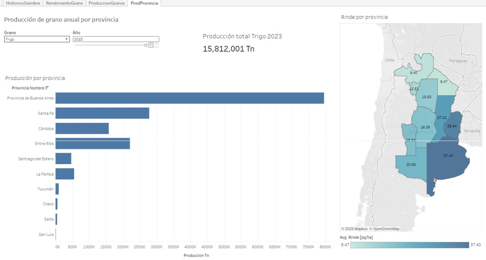

# Agricultura Argentina (maiz, soja y trigo)

Se presenta un análisis basado en los datos del portal del gobierno sobre la siembre, cosecha, producción y rendimientos de los principales granos en Argentina. La información proviene de 3 datasets distintos cuyas fuentes se mencionan a continuación:

- Maiz: https://datos.gob.ar/dataset/agroindustria-maiz---siembra-cosecha-produccion-rendimiento/archivo/agroindustria_9a6a02f8-ef58-4250-87c2-f639fec502f1
- Soja: https://datos.gob.ar/dataset/agroindustria-soja---siembra-cosecha-produccion-rendimiento/archivo/agroindustria_ba694aa3-99d2-4d7d-9936-60f88e36ad9a
- Trigo: https://datos.gob.ar/dataset/agroindustria-trigo---siembra-cosecha-produccion-rendimiento/archivo/agroindustria_50f0edcc-4dfc-4afb-b78a-b164601d36ae

Los tres conjuntos de datos tienen el mismo formato en sus columnas:

| Título de la columna          | Tipo de dato                | Descripción                                   |
|-------------------------------|-----------------------------|-----------------------------------------------|
| cultivo_nombre               | Texto (string)              | Nombre del cultivo.                           |
| anio                         | Número entero (integer)     | Año a que corresponden los datos.             |
| campania                    | Texto (string)              | Campaña en la que se desarrolló el cultivo.   |
| provincia_nombre             | Texto (string)              | Nombre de la provincia.                       |
| provincia_id                 | Texto (string)              | Código de la provincia.                       |
| departamento_nombre          | Texto (string)              | Nombre del departamento.                      |
| departamento_id              | Texto (string)              | Código del departamento.                      |
| superficie_sembrada_ha       | Número entero (integer)     | Superficie sembrada en hectáreas.             |
| superficie_cosechada_ha      | Número entero (integer)     | Superficie cosechada en hectáreas.            |
| produccion_tm                | Número entero (integer)     | Producción en toneladas.                      |
| rendimiento_kgxha            | Número entero (integer)     | Rendimiento en kilos por hectárea.            |

## Data Cleaning

Se realiza una limpieza de los datos previo a unificar los tres datasets en uno solo. Se buscan incosistencias, valores nulos que puedan afectar resultados y se ajustan las fechas de la serie de tiempo para evaluar los mismos períodos en todos los granos.

### Datatype
Debido a que los tipos de datos para algunas de las columnas son distintas, se unificarán los mismos para poder concatenar todos los datasets en uno mismo.

### Filter date
- Serie maiz: 1923-2023
- Serie soja: 1941-2023
- Serie trigo: 1927-2024

Se tomará la intersección entre ambos para hacer un análisis en la serie *(1941-2023)*.

#### Cleaning
- Documentamos y eliminamos las entradas donde la siembra es nula puesto que si este valor es 0, no tiene sentido la cosecha.
- Si la siembre es mayor a cero, pero la cosecha es nula (0), tomaremos la entrada como que la cosecha se ha perdido y es relevante para la estadística.
- Eliminamos entradas con valores negativos.
- Corregimos valores para entradas donde superficie_cosecha > superficie_siempre
- Si siembra > 0 y cosecha > 0 pero rinde es 0 -> eliminamos la entrada
- Si el rinde en el grano es mayor a MAX_RINDE_SOJA (trigo o maiz) definido -> eliminamos la entrada

#### Exportar a CSV

Se exportan los datos limpios a un nuevo CSV: **granos_argentina_1941_2023.csv**

## Data Analysis

- Se calcula el porcentaje de cosecha sobre la siembre de cada entrada para agregarlo en una nueva columna antes de exportar a la base de datos.
- Se guardan los resultados en una base de datos: Granos_Argentina.db
- Se definen funciones para leer query y tenerlas almacenadas en extensiones .sql ('load_query' y 'run_query')

### Consultas realizadas.

1. Producción total y rendimiento promedio por año y grano: (produccion_anual.sql)[queries/produccion_anual.sql]
2. Producción y siembra total por provincia y grano: para identificar las provincias más importantes para cada cultivo: (produccion_por_provincia.sql)[queries/produccion_por_provincia.sql]
3. Rendimiento Promedio de los cultivos a lo largo del tiempo: (rendimiento_promedio_anual.sql)[queries/rendimiento_promedio_anual.sql]

## Visualización

Se utiliza el CSV granos_argentina_1941_2023 para generar las visualizaciones en Tableu

[Tableau](https://public.tableau.com/views/HistoriadegranosenArgentina/Produccionporprovincia?:language=en-US&publish=yes&:sid=&:redirect=auth&:display_count=n&:origin=viz_share_link).

