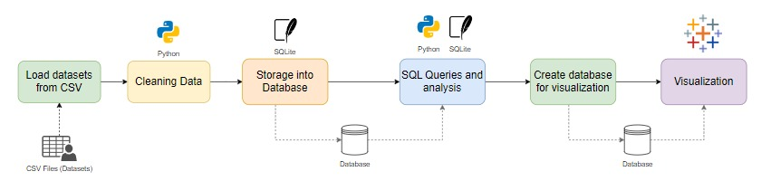
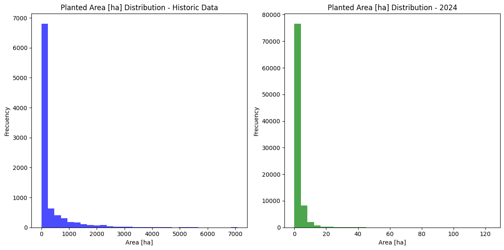

# 🇦🇷 Argentine Vineyard Surface Analysis (2012-2024)

This project analyzes the historical evolution (2012-2024) and detailed composition (2024) of vineyard surface area across Argentina.

**Key Objectives:**
* Track national and provincial trends over time (2012-2024)
* Analyze the distribution of vineyards by variety, color, and cultivation system in 2024.
* Integrate data from two distinct sources using Python for cleaning and transformation.
* Filter data by SQL Queries (SQLite).
* Visualization using Tableau.

**Sources**
[Goverment Dataset](https://datos.gob.ar/dataset/agroindustria-inv---superficie-implantada-con-vinedos)

## Step-by-Step

In the image below there is a Summary Diagram of the Project


### 1) Data Cleaning
Here we use both Google Sheets and Python (Jupyter Notebook) in order to clean the data. This includes:
- Check for nulls
- Check for data types
- Check for duplicates

#### Results:
- In "inv-superficie-id-2024.csv" from 88306 to 86687 rows
- In "inv-superficie-viniedos-2012-2024.csv" from 9053 to 9052 rows

### 2) Import CSV Data into Pandas DataFrame
Importing both, the historial dataset from 2012 to 2024 and the dataset with all the information about a single year (2024).
- Historical Dataset:

| Nro | Column | Non-Null Count | Dtype |
| :---: | :--- | :---: | :--- |
| 0 | anio | 9053 non-null | int64 |
| 1 | provincia_id | 9053 non-null | int64 |
| 2 | provincia_nombre | 9053 non-null | object |
| 3 | departamento_id | 9053 non-null | int64 |
| 4 | departamento_nombre | 9053 non-null | object |
| 5 | localidad_id | 9053 non-null | object |
| 6 | localidad_nombre | 9053 non-null | object |
| 7 | superficie\_ha | 9053 non-null | float64 |

- 2024 Dataset: province, department, locality, variety, color, year_of_plantation, planted_area_ha

### 3) Check for statistics and distribution.

- Using describe(), and info() method to quickly analize the limits.
- Planted area distribution



### 4) Save DataFrame into a SQLite database

```python
import sqlite3

conn = sqlite3.connect(SQLITE_DB)
df_historico.to_sql('historico_vinedos', conn, if_exists='replace', index=False)
df_2024.to_sql('vineyards_2024', conn, if_exists='replace', index=False)
conn.close()
```

### 5) SQL Queries to analyze data

- Analyze historical planted area by province
- Analyze distribution of the years of plantation in the 2024 dataset
- Analyze colors distribution by province

### 6) Export new tables for plotting in Tableau
https://public.tableau.com/app/profile/valentin.bellini/viz/Vineyards_17644225642040/Map?publish=yes