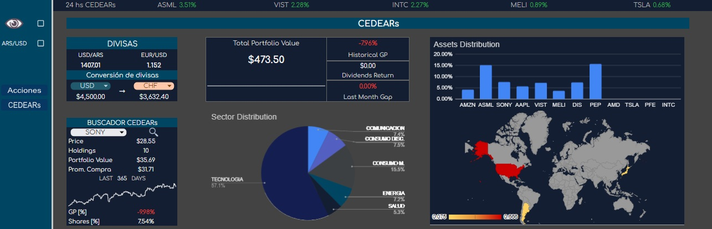

# Data Analyst Portfolio
---

Welcome to my Data Analyst Portfolio repository. This collection showcases several end-to-end projects where I apply data analytics, data cleaning, visualization, and basic machine learning techniques. Each project is organized in its own directory and includes documentation, code, and data workflows.

Some of the tools I've used: **Python (Pandas, Numpy, Matplotlib, Jupyter Notebooks), SQL, Google Sheets, Tableau and R**.

## PROJECTS

### 1. [Finance Portfolio Tracker](FinancePortfolioTracker/README.md) 

This project is built in Google Sheets, leveraging Google Finance functions and SQL queries for data transformation. It tracks investment operations (stocks, crypto, commodities, etc.) and generates a dynamic dashboard for performance monitoring.

Includes:
- Automated price tracking
- Portfolio performance metrics
- Operation history management
- Visual dashboard

### 2. [Argentine Vineyard Analysis](Argentina_Vineyard_Analysis\README.md)

A personal project using Python, and SQL with public government datasets. The analysis focuses on vineyards in Argentina, exploring production, geographical distribution, and long‑term trends.

### 3. [Agricultura Argentina](AgriculturaArgentina/README.md)

A Spanish‑language data project diving into Argentina's agricultural sector. The workflow includes cleaning, feature creation, exploratory data analysis, and visualization in [Tableau](https://public.tableau.com/views/HistoriadegranosenArgentina/Produccionporprovincia?:language=en-US&publish=yes&:sid=&:redirect=auth&:display_count=n&:origin=viz_share_link).

### 4. [Machine Learning](ML/EN-Summary.md)

A collection of exercises and summaries from [Microsoft Machine Learning for Begginers](https://github.com/microsoft/ML-For-Beginners) and additional university coursework.

Topics include:
- Regression & Classification
- Clustering
- Model training and evaluation
- Feature preprocessing
- Basic ML workflows

Note: You can find most of the projects in [this repository](https://github.com/valentinbellini/Magic-Learning).
